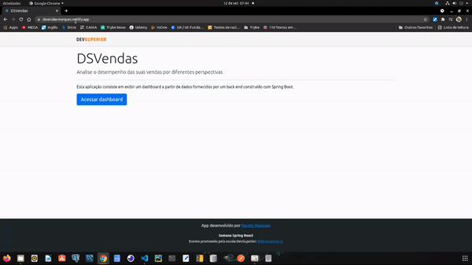
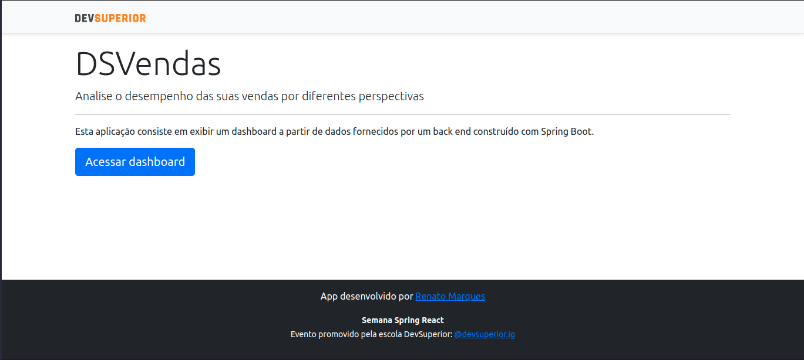
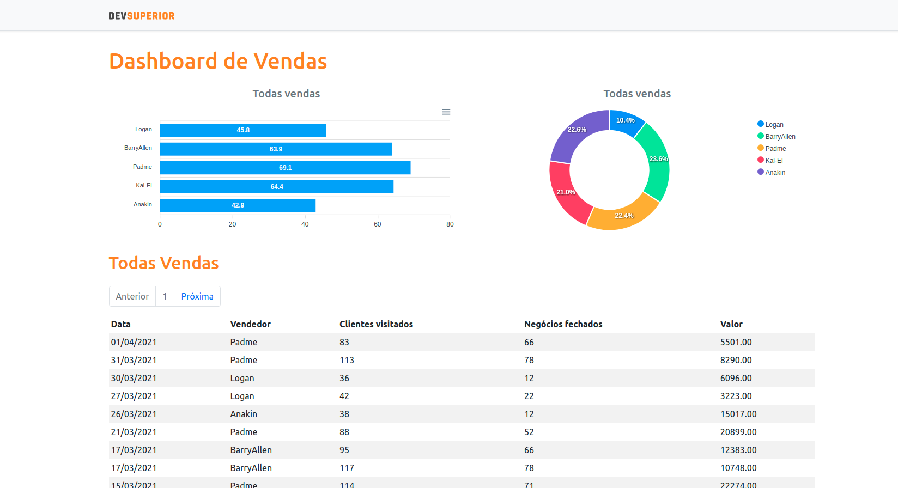
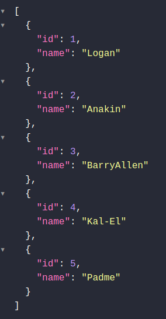
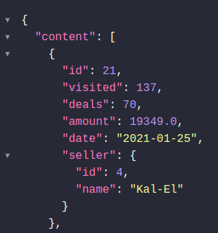
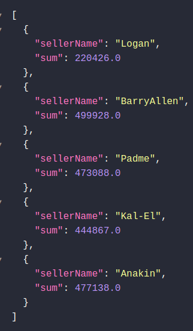
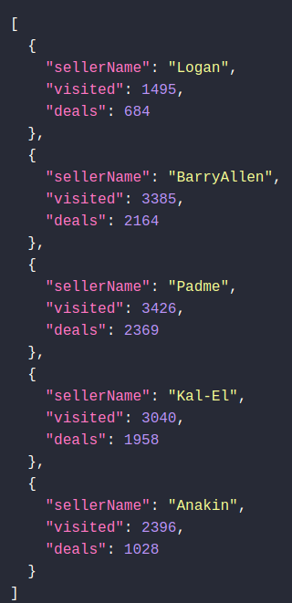

# DSVendas - Dashboard para análise de dados

## Sobre o projeto

Esta é uma aplicação full stack web construída na Semana Spring React - SDS 4.0 da DevSuperior.
A aplicação tem o Backend criado em Spring Boot, Java e o Banco de Dados Relacional Postgresql.
O Frontend é feito com React, typescript e Bootstrap.
O principal objetivo da aplicação é possibilitar a análise detalhada dos dados inseridos no Banco de Dados. É possível analisar a porcentagem e quantidade de vendas de cada vendedor.

## Itens obrigatórios:

- [x] Criar projetos backend e frontend;
- [x] Salvar os projeto no Github;
- [x] Montar o visual estático do frontend;
- [x] Publicar o frontend no Netlify;
      Implementar o backend
- [x] Modelo de domínio
- [x] Estruturar o backend no padrão camadas
- [x] Consulta paginada de vendas
- [x] Consultas agrupadas para gráficos
- [x] Implantação na nuvem (Heroku)
- [x] Integrar backend e frontend

## Layout

<h1 align="center">
  
  
</h1>

## Modelo conceitual

<h1 align="center">
   
</h1>

# Tecnologias utilizadas

## Back end

 &nbsp; &nbsp; &nbsp; &nbsp;
 &nbsp; &nbsp; &nbsp; &nbsp;
 &nbsp; &nbsp; &nbsp; &nbsp;
 &nbsp; &nbsp; &nbsp; &nbsp;

## Front end

 &nbsp; &nbsp; &nbsp; &nbsp;
 &nbsp; &nbsp; &nbsp; &nbsp;
 &nbsp; &nbsp; &nbsp; &nbsp;
 &nbsp; &nbsp; &nbsp; &nbsp;

## Implantação em produção

 &nbsp; &nbsp; &nbsp; &nbsp;
 &nbsp; &nbsp; &nbsp; &nbsp;

# Como executar o projeto localmente

1º - Clone o [Repositório](https://github.com/renatomak/projeto-sds3) do projeto no GitHub

Pré-requisitos:
npm / yarn
Spring Tool Suite

## Backend

2. inicie o servidor na ferramenta [Spring_Tool_Suite](https://spring.io/tools)

## Frontend

2. Entre na pasta frontend
3. Instale as dependências - npm install ou yarn install
4. Inicie o projeto - npm start ou yarn start

## Acesse:

Aplicação: [DSVendas](https://dsvendas-marques.netlify.app/)

API: [API-DSVendas](https://sds3-renatomak.herokuapp.com/)

### Os endpoints disponíveis são:

[sellers](https://sds3-renatomak.herokuapp.com/sellers)

#### Exemplo de retorno:

[Sales_pagination](https://sds3-renatomak.herokuapp.com/sales?page=1&sort=date,desc)

#### Exemplo de retorno:

[Amount_by_seller](https://sds3-renatomak.herokuapp.com/sales/amount-by-seller)

#### Exemplo de retorno:

[Success_by_seller](https://sds3-renatomak.herokuapp.com/sales/success-by-seller)

#### Exemplo de retorno:

## Proximos Passos

- Criar os endpoints: create, update e delete.
